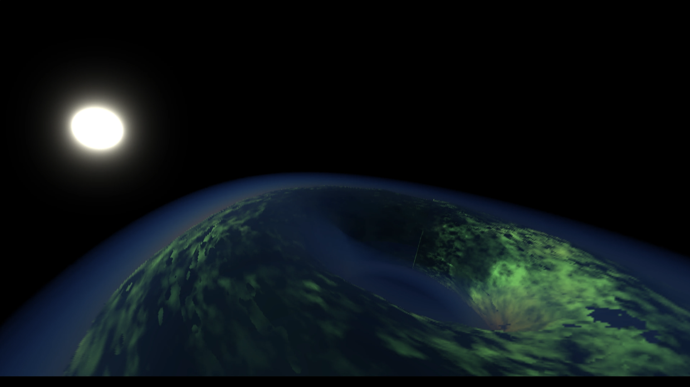
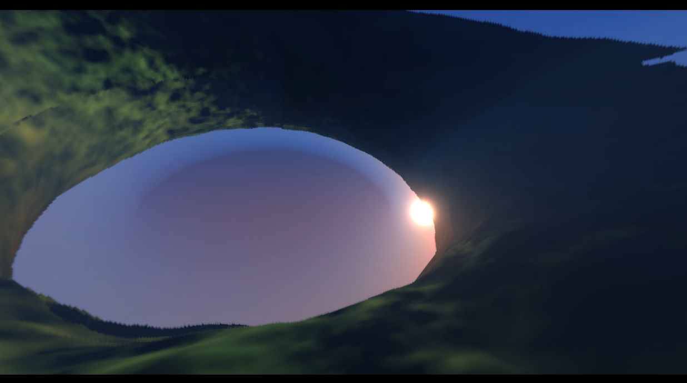

# Torveil

**An open world voxel sandbox on a toroidal planet — built from scratch in C++ to be fun to play and fast to run.**

`C++20` · `OpenGL` · `CMake + vcpkg` · `Windows & Linux` · `~74k lines`

 

---

## The goal

An open world worth exploring with friends, running as fast as the hardware allows. Renderer, world
simulation, netcode and services are written from scratch in C++20 — no engine sits between the game
and the frame budget, so performance is a design constraint at every layer rather than a pass at the
end.

## Highlights

**A world shaped like a torus.** Finite, seamless, no edges and no poles — travel far enough in any
direction and you arrive where you started. Coordinates, chunk indexing, streaming and seeded terrain
generation are all built around that geometry.

**Built for frame rate.** GPU-driven instanced voxel geometry with indirect draws and subchunk
batching, LOD bands that cross-fade instead of popping, chunks generated and streamed on demand,
lock-free task queues, and a built-in GPU/CPU profiler to keep every pass honest.

**A renderer from the ground up.** Custom OpenGL engine behind a backend-agnostic interface: cascaded
shadows, sky and atmosphere, SSAO, screen-space reflections, TAA, ordered transparency, glTF/OBJ
meshes and a tunable post-process chain.

**Multiplayer over the real internet.** A custom protocol over UDP with encrypted sessions, reliable
and unreliable channels, congestion control, fair bandwidth sharing and host reconnection — plus
accounts, friends, matchmaking and world browsing behind HTTPS services.

## Technology

| Area | Stack |
|---|---|
| **Language & build** | C++20, CMake, vcpkg, Windows and Linux |
| **Graphics** | OpenGL, GLAD, GLFW, GLM, custom shader pipeline |
| **UI & assets** | RmlUi, stb, glTF (cgltf), OBJ (tinyobjloader) |
| **Networking** | ENet + custom reliability, encryption and traffic control |
| **Services** | cpp-httplib, OpenSSL, JSON APIs, Oracle Database |
| **Runtime** | Lock-free task queues, thread pools, binary world serialization, spdlog |
